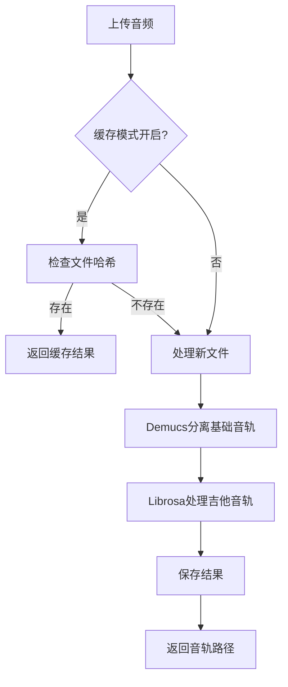

# 音频处理系统优化 - 缓存机制与吉他音轨支持

## 需求背景

1. 缓存机制
   - 问题：每次上传相同音频都需要重新处理，耗时且资源浪费
   - 目标：添加缓存模式开关，便于调试和性能优化

2. 吉他音轨
   - 问题：现有系统不支持吉他音轨单独分离
   - 目标：增加吉他音轨分离功能，提供更全面的乐器分离支持

## 技术方案



### 关键技术点

1. 缓存实现
   - 使用文件哈希作为缓存标识
   - 前端状态管理控制缓存行为
   - 后端文件系统实现持久化

2. 吉他音轨处理
   - 使用librosa音频处理库
   - 基于频率特征和谐波分析
   - 适配M1芯片优化性能

## 核心代码

### 前端缓存控制
```jsx
// AudioPlayer.jsx
<div className="mt-4 p-4 bg-white rounded-lg shadow">
  <h3 className="text-lg font-medium text-gray-700 mb-2">调试选项</h3>
  <div className="flex items-center">
    <label className="inline-flex items-center cursor-pointer">
      <input
        type="checkbox"
        className="sr-only peer"
        checked={cacheMode}
        onChange={(e) => setCacheMode(e.target.checked)}
      />
      <div className="relative w-11 h-6 bg-gray-200 peer-focus:outline-none peer-focus:ring-4 peer-focus:ring-blue-300 rounded-full peer dark:bg-gray-700 peer-checked:after:translate-x-full rtl:peer-checked:after:-translate-x-full peer-checked:after:border-white after:content-[''] after:absolute after:top-[2px] after:start-[2px] after:bg-white after:border-gray-300 after:border after:rounded-full after:h-5 after:w-5 after:transition-all dark:border-gray-600 peer-checked:bg-blue-600"></div>
      <span className="ms-3 text-sm font-medium text-gray-700">启用缓存模式</span>
    </label>
  </div>
</div>
```

### 后端吉他音轨处理
```python
def extract_guitar_track(input_path, output_path):
    """使用librosa提取吉他音轨（简化版本）"""
    try:
        # 加载音频文件
        y, sr = librosa.load(input_path, sr=None)
        
        # 提取谐波部分
        y_harmonic = librosa.effects.harmonic(y)
        
        # 应用带通滤波器，保留吉他主要频率范围(80Hz-1200Hz)
        y_filtered = librosa.effects.preemphasis(y_harmonic)
        
        # 使用STFT进行时频分析
        D = librosa.stft(y_filtered)
        S = np.abs(D)
        
        # 创建频率掩码，重点保留吉他频率范围
        freqs = librosa.fft_frequencies(sr=sr)
        mask = np.logical_and(freqs >= 80, freqs <= 1200)[:, np.newaxis]
        
        # 应用掩码并重建信号
        y_guitar = librosa.istft(D * mask)
        
        # 标准化音量
        y_guitar = librosa.util.normalize(y_guitar)
        
        # 保存吉他音轨
        guitar_path = os.path.join(output_path, 'guitar.wav')
        sf.write(guitar_path, y_guitar, sr)
        return guitar_path
    except Exception as e:
        logger.error(f"Error extracting guitar track: {str(e)}")
        return None
```

## 效果与优化

1. 性能提升
   - 缓存模式减少重复处理
   - 简化的音频处理算法提高兼容性

2. 可用性改进
   - 直观的UI控制缓存行为
   - 完整的调试信息记录

3. 注意事项
   - 缓存文件需要定期清理
   - 吉他音轨分离效果依赖输入音频质量