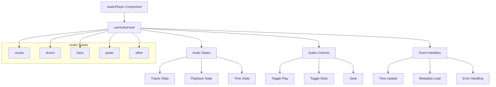

# 支持音频拖拽、分轨静音播放

## 需求背景

在原有的音频播放器实现中存在以下问题：
1. 点击静音按钮会导致所有音轨静音，而不是仅静音当前音轨
2. 进度条拖拽后音频会从头开始播放，而不是从指定位置继续
3. vocals音轨的静音/取消静音行为与其他音轨不一致

## 系统架构



## 技术方案

### 1. 状态管理优化

```javascript
// 音轨状态结构
const [tracks, setTracks] = useState({
  vocals: { volume: 1, muted: false, lastVolume: 1, url: null },
  drums: { volume: 1, muted: false, lastVolume: 1, url: null },
  // ...其他音轨
});

// 播放控制状态
const [isPlaying, setIsPlaying] = useState(false);
const [currentTime, setCurrentTime] = useState(0);
const wasPlayingRef = useRef(false); // 用于保存拖拽时的播放状态
```

### 2. 音轨独立控制

关键改进：使用audio元素的muted属性而不是volume来控制静音状态，确保音量和静音状态的独立性。

```javascript
const toggleMute = (track) => {
  const audioElement = audioRefs[track].current;
  if (!audioElement) return;

  setTracks(prev => {
    const trackData = prev[track];
    const newMuted = !trackData.muted;
    
    // 直接设置audio元素的muted属性
    audioElement.muted = newMuted;
    
    // 如果取消静音，同步到当前播放位置
    if (!newMuted) {
      const currentPos = currentTime;
      audioElement.currentTime = currentPos;
      
      // 如果当前正在播放，则开始播放这个音轨
      if (isPlaying) {
        audioElement.play().catch(console.error);
      }
    }

    return {
      ...prev,
      [track]: {
        ...trackData,
        muted: newMuted
      }
    };
  });
};
```

### 3. 进度控制优化

关键改进：保存拖拽前的播放状态，确保从正确位置继续播放。

```javascript
const handleSeek = (time) => {
  if (isSettingTime) return;
  
  setIsSettingTime(true);
  try {
    // 保存当前播放状态
    wasPlayingRef.current = isPlaying;
    
    // 如果正在播放，暂时暂停所有音轨
    if (isPlaying) {
      Object.values(audioRefs).forEach(ref => {
        const audio = ref.current;
        if (audio && !audio.muted) {
          audio.pause();
        }
      });
    }

    // 设置新的播放位置
    Object.values(audioRefs).forEach(ref => {
      const audio = ref.current;
      if (audio && !audio.muted) {
        audio.currentTime = time;
      }
    });
    setCurrentTime(time);

    // 如果之前在播放，恢复播放
    if (wasPlayingRef.current) {
      Object.values(audioRefs).forEach(ref => {
        const audio = ref.current;
        if (audio && !audio.muted) {
          audio.play().catch(console.error);
        }
      });
    }
  } finally {
    setIsSettingTime(false);
  }
};
```

### 4. 音频同步机制

关键改进：简化音频同步逻辑，减少不必要的状态更新。

```javascript
useEffect(() => {
  const audioElements = Object.values(audioRefs).map(ref => ref.current);
  if (!audioElements.length) return;

  const handleTimeUpdate = (event) => {
    if (!isSettingTime) {
      const newTime = event.target.currentTime;
      setCurrentTime(newTime);
      setDuration(event.target.duration);
    }
  };

  audioElements.forEach(audio => {
    if (audio) {
      audio.addEventListener('timeupdate', handleTimeUpdate);
    }
  });

  return () => {
    audioElements.forEach(audio => {
      if (audio) {
        audio.removeEventListener('timeupdate', handleTimeUpdate);
      }
    });
  };
}, [isSettingTime]);
```

## 主要改进点

1. 音轨控制
   - 移除了主音轨概念，所有音轨平等处理
   - 使用audio.muted属性替代volume=0来实现静音
   - 取消静音时自动同步到当前播放位置

2. 进度控制
   - 添加wasPlayingRef保存拖拽前的播放状态
   - 优化了进度设置逻辑，确保平滑过渡
   - 改进了播放位置同步机制

3. 状态管理
   - 简化了状态更新逻辑
   - 优化了事件监听器的处理
   - 改进了错误处理机制

## 后续优化建议

1. 考虑添加音轨预加载机制，提升切换响应速度
2. 可以添加音轨淡入淡出效果，提升用户体验
3. 考虑添加音轨波形显示功能
4. 可以考虑添加音轨分组功能，方便批量控制
