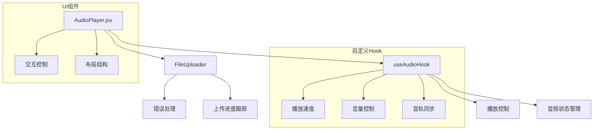

# 音频播放器重构方案

> 创建时间：2025/03/09

## 需求背景

### 问题描述
1. 播放功能异常
   - 点击播放按钮无声音
   - 音轨同步问题
   - 浏览器自动播放策略限制
2. 代码结构问题
   - AudioPlayer.js和AudioPlayer.jsx存在重复逻辑
   - 音频控制和UI展示逻辑混合
   - 文件上传和错误处理分散

## 架构设计

### 整体架构


### 模块职责
1. useAudioHook
   - 音频状态管理
   - 播放控制逻辑
   - 音轨同步处理
   - 自动播放策略
2. FileUploader
   - 文件上传处理
   - 进度跟踪
   - 错误处理
3. AudioPlayer.jsx
   - UI渲染
   - 用户交互
   - 状态展示

## 核心实现

### 1. 音频同步控制
```javascript
// useAudioHook.js
const syncTime = (sourceTime) => {
  if (isSettingTime) return;
  isSettingTime = true;
  audioElements.forEach(audio => {
    if (audio && Math.abs(audio.currentTime - sourceTime) > 0.1) {
      audio.currentTime = sourceTime;
    }
  });
  isSettingTime = false;
};
```

### 2. 自动播放策略
```javascript
// useAudioHook.js
const playPromises = audioElements.map(async (audio) => {
  if (audio && audio.src) {
    try {
      await audio.play();
    } catch (err) {
      // 处理自动播放限制
      audio.muted = true;
      await audio.play();
      audio.muted = false;
    }
  }
});
```

### 3. 文件上传进度
```javascript
// fileUploader.js
const uploadPromise = new Promise((resolve, reject) => {
  xhr.upload.onprogress = (event) => {
    if (event.lengthComputable) {
      const percentComplete = (event.loaded / event.total) * 100;
      onProgress(Math.round(percentComplete));
    }
  };
});
```

## 主要改进

1. 代码结构优化
   - 分离音频控制逻辑到自定义Hook
   - 统一文件上传处理
   - 删除冗余组件

2. 功能改进
   - 添加音频预加载检查
   - 实现精确的音轨同步
   - 优化自动播放处理
   - 改进错误提示

3. 用户体验提升
   - 添加上传进度显示
   - 优化音轨控制布局
   - 改进播放状态反馈

## 测试验证

### 测试项目
1. 音频播放功能
   - 上传音频文件
   - 点击播放按钮
   - 验证所有音轨同步播放
   - 测试音量和速度控制

2. 自动播放处理
   - 首次播放时验证
   - 检查静音自动播放功能
   - 验证取消静音后的播放状态

3. 文件上传
   - 验证进度显示
   - 测试错误处理
   - 检查上传完成后的状态更新

## 后续优化

1. 性能优化
   - 添加音频文件缓存
   - 优化大文件上传
   - 实现音轨预加载

2. 功能扩展
   - 添加波形显示
   - 支持更多音频格式
   - 键盘快捷键控制

## 风险评估

1. 浏览器兼容性
   - 自动播放策略差异
   - 音频API支持程度
   - CSS样式兼容性

2. 性能考虑
   - 多音轨同步精度
   - 内存占用
   - 上传大文件处理
